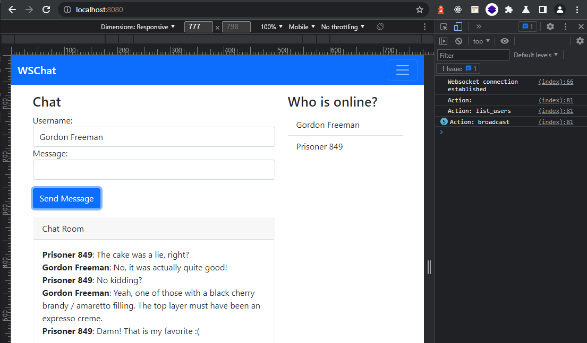

# Websockets in Go

This project are my notes following along a tutorial by [tsawler](https://github.com/tsawler/) and can be found [on Github](https://github.com/tsawler/ws-udemy).


## Usage

Start the application with:

```bash
go run src/web/*.go
```

or the following command on Windows (I think?):

```bash
go run src/web/.
```



